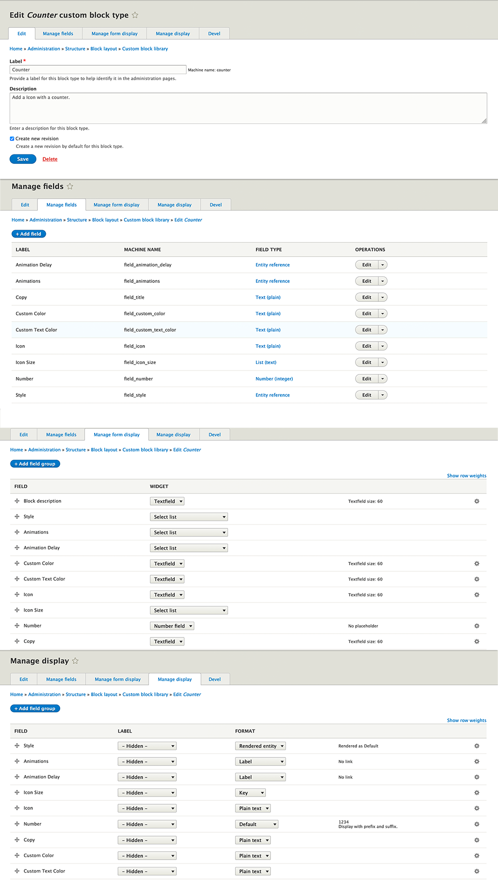

# *Add to the subtheme.libraries.yml*

#Counter  
gt-counter:  
version: "2.0.x"  
css:  
theme:  
//cdnjs.cloudflare.com/ajax/libs/animate.css/4.1.1/animate.min.css: { type: external }  
templates/block/custom/counter/css/gt-counter.css: {}  
js:  
//cdnjs.cloudflare.com/ajax/libs/waypoints/4.0.1/jquery.waypoints.min.js: { type: external }  
templates/block/custom/counter/js/jquery.counterup.js: {}  
templates/block/custom/counter/js/counter.js: {}  
templates/block/custom/counter/js/waypoint.js: {}  
dependencies:  
- core/jquery  

# *Add to the repositories section in subtheme composer.json*

"repositories": [  
{  
"type": "vcs",  
"url": "https://github.gatech.edu/ICWebTeam/block_counter.git"  
}
# *Add to the require in subtheme composer.json*

"require": {  
"gt/counter": "dev-master"  
"mnsami/composer-custom-directory-installer": "^2.0" 
},

# *Add to the sub_theme.theme*
function subtheme_page_attachments_alter(&$page) {  
$page['#attached']['library'][] = 'subtheme/gt-counter';}  

# *Add to the installer paths in subtheme composer.json*
"installer-paths": {  
"web/themes/contrib/SUBTHEME/templates/block/custom/counter": [  
"gt/counter"  
]  

# *Implements hook_page_attachments_alter(). in subtheme.theme*
function SUBTHEME_page_attachments_alter(&$page) { 
$page['#attached']['library'][] = 'SUBTHEME/counter'; 
}
},

# **CUSTOM BLOCK  SET-UP**

# **TAXONOMY SET-UP**

